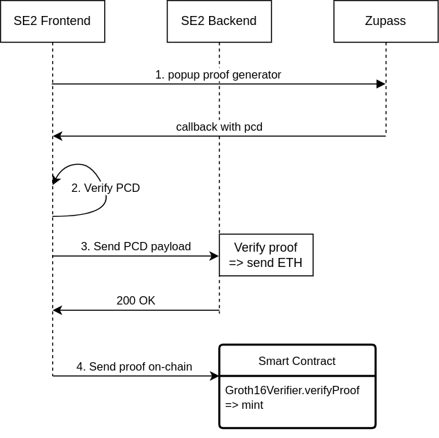

# 🏗 ETHBerlin Zupass: SE2 Starter Kit

TLDR: 🎥 [watch the intro video here](https://youtu.be/7SGaMHOYc04)

Get started with [Zupass](https://github.com/proofcarryingdata/zupass) to generate proofs & verify PCDs (Proof-Carrying Data).

In this Starter Kit you'll find an example of how to generate a proof and verify it on the backend.
- **Frontend** (check `packages/nextjs/pages/index.tsx`):
  - Using `zuauth` we generate a popup where you can generate a proof in your Zupass account.
  - It then sends the PCD to the backend.
- **Backend** (check `packages/nextjs/pages/api/verify.ts`):
  - Verifies the proof received from the frontend.
  - If the proof is valid, it sends 1 ETH to the connected wallet address.

---



---

Before you begin, you need to install the following tools:

- [Node (>= v18.17)](https://nodejs.org/en/download/)
- Yarn ([v1](https://classic.yarnpkg.com/en/docs/install/) or [v2+](https://yarnpkg.com/getting-started/install))
- [Git](https://git-scm.com/downloads)

## Quickstart

To get started with Scaffold-ETH 2, follow the steps below:

1. Clone this repo & install dependencies

1. Clone the repo
```bash
git clone https://github.com/BuidlGuidl/ethberlin-zupass-starterkit
cd ethberlin-zupass-starterkit
```

2. Install dependencies
```bash
yarn install
```

3. Start the local hardhat chain
```bash
yarn chain
```

4. On a second terminal, deploy the contracts
```bash
yarn deploy
```

5. Start the frontend
```bash
yarn start
```

Visit your app on http://localhost:3000/

### Resources

🎥 [Watch the BG & Zupass team first zoom meeting here](https://youtu.be/kwACdt3gRms)
🎥 [Watch the BG & Zupass team second zoom meeting here](https://www.youtube.com/watch?v=yY7XdaCjC7I)

Some links mentioned in the video

https://github.com/proofcarryingdata/zupass

part1)
https://github.com/proofcarryingdata/zupass/blob/main/apps/passport-server/src/services/telegramService.ts#L1104

part2)
https://github.com/proofcarryingdata/zupass/blob/main/apps/passport-server/src/services/telegramService.ts#L554

part3)
https://github.com/proofcarryingdata/zupass/blob/main/apps/passport-server/src/services/telegramService.ts#L736

https://github.com/odyslam/zuzalu-oracle/blob/master/src/ZuzaluOracle.sol
https://api.zupass.org/issue/known-ticket-types
https://github.com/iden3/snarkjs
https://github.com/cedoor/zuauth
https://github.com/cedoor/zuauth/tree/main#-tutorial
https://www.npmjs.com/package/@pcd/passport-interface
https://www.npmjs.com/package/@pcd/zk-eddsa-event-ticket-pcd
https://www.npmjs.com/package/@pcd/eddsa-ticket-pcd
https://www.npmjs.com/package/@pcd/semaphore-identity-pcd
https://www.npmjs.com/package/@pcd/eddsa-ticket-pcd

